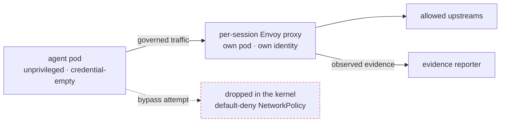

**Scrutineer** governs autonomous AI agents on Kubernetes: per-session policy, human
approvals, and runtime evidence produced **outside the agent's trust domain**. A
compromised agent can't bypass the rules or edit the record.

Not an agent framework. You bring your own agent image. Scrutineer wraps it in
governance it can't reach.

## How it works

Each run is an `AgentSession`. The controller starts the agent pod, a **per-session
Envoy proxy**, and a default-deny NetworkPolicy that makes the proxy the agent's
**only** way out is enforced in the kernel, outside the agent's reach.



Every decision lands in the session's status, labeled by source: **`observed`**
(the proxy) or **`self-reported`** (the agent). Neither pretends to be the other.

## Quick start

```sh
git clone https://github.com/grantbarry29/scrutineer.git
cd scrutineer
make quickstart   # kind cluster + verified enforcement (~5 min)
make demo         # a denial, a dead bypass, the evidence (~2 min)
```

## Start here



One command to a verified install on kind.


A live denial, a dead bypass, and the evidence.


Every command visible, on your own cluster.


Sessions, policies, the two locks, evidence.



## Learn more



Source, issues, and reference docs.


Threat model and every stated boundary.


Your agent can edit its own audit log.


Why not just a firewall or a CNI?


